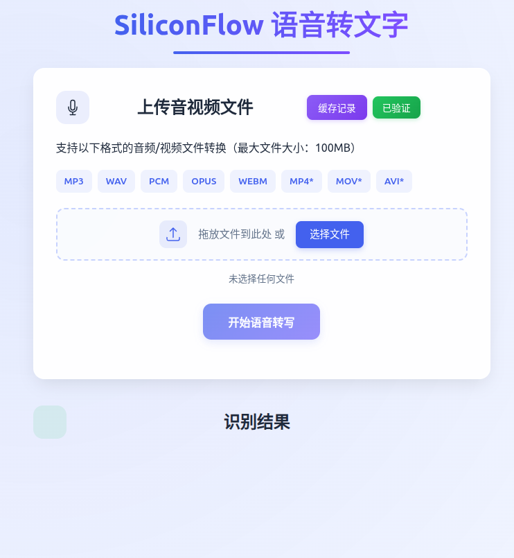
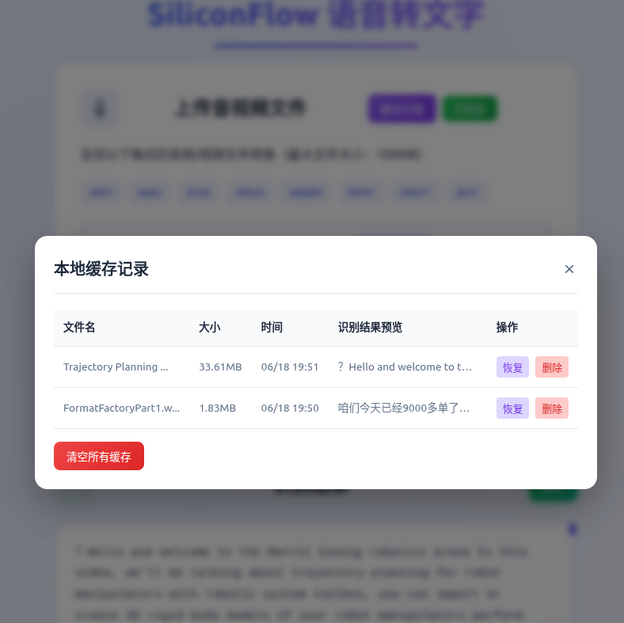

# siliconflow-stt 🎙️

## 项目简介 🚀
siliconflow-stt 是一个基于 Cloudflare Pages 的智能语音转文字（Speech-to-Text，STT）服务。用户可以通过前端页面上传音/视频文件，系统会将其发送到后端 API 进行转写，并将结果返回展示。  

## 功能
- 🗂️ 文件上传：支持拖拽或选择上传本地音频/视频文件（支持格式包括 MP3、WAV、PCM、OPUS、WEBM 等）。若上传视频，浏览器将自动提取音轨进行处理。
- 🔑 口令验证：通过口令机制确保仅授权用户可以访问转写接口。
- ⚡ 本地结果缓存：已转写的文件将缓存于本地，避免重复调用接口，加快体验速度。

## 目录结构
```
.
├── functions/
│   ├── transcribe.js 
│   └── verify.js 
├── public/
│   └── index.html
├── wrangler.toml
└── README.md
```

## 部署 🛠️

本项目使用 Cloudflare Pages 托管静态资源，并可选配合 Pages Functions。以下为两种常见的部署方式。

1. 使用 Wrangler CLI 部署
  - 已安装 Node.js 和 npm  (若已安装可跳过)
  - 已安装并登录 Wrangler CLI：  
    ```bash
    npm install -g wrangler
    wrangler login
    ```
  - 注入环境变量 (项目名称可修改)
    ```bash
    wrangler pages secret put VERIFY_TOKENS --project-name siliconflow-stt
    wrangler pages secret put SILICONFLOW_API_KEYS --project-name siliconflow-stt
    ```
  - 执行部署
    ```bash
    wrangler pages deploy public --project-name siliconflow-stt
    ```
2. 通过 Dashboard + Git 集成部署
  - 登录 Cloudflare → Pages → 选择本项目 → Settings → Git integration，关联你的 GitHub/GitLab/Bitbucket 仓库。
  - 在 Build settings 中设置：
    - **Build output directory**：public
  - 在 Environment variables & secrets （**变量与机密**）页面，分别新增：
    - 口令变量 Key: VERIFY_TOKENS
    - 硅基密钥 Key: SILICONFLOW_API_KEYS
  - Push 代码到配置的分支，Pages 会自动拉取、构建并部署。

## 使用截图 📸


